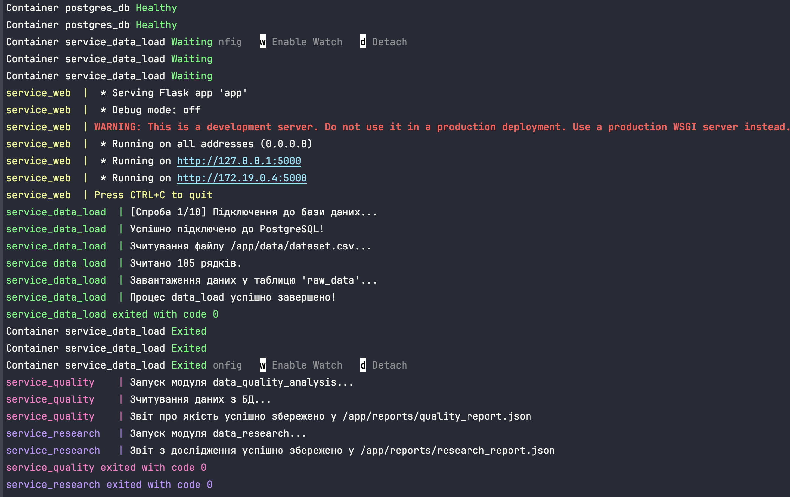
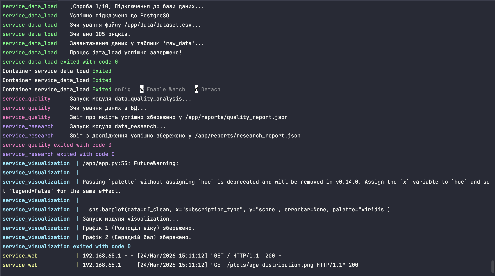
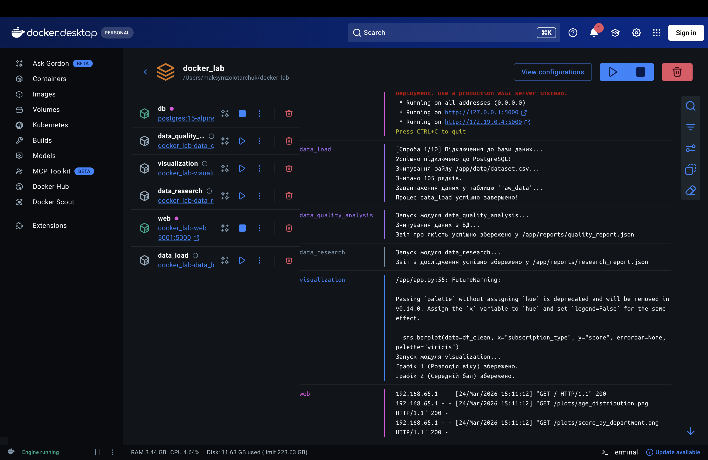
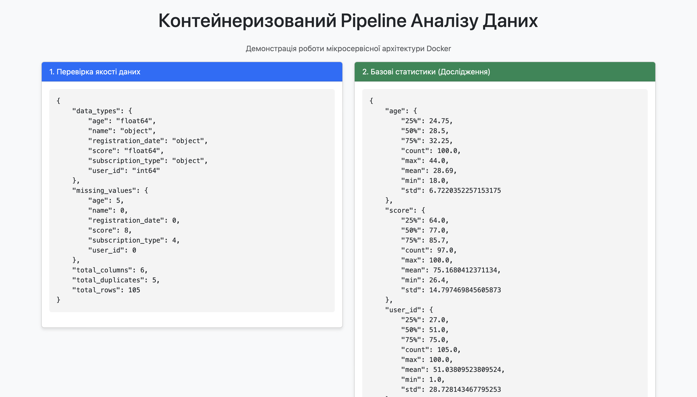
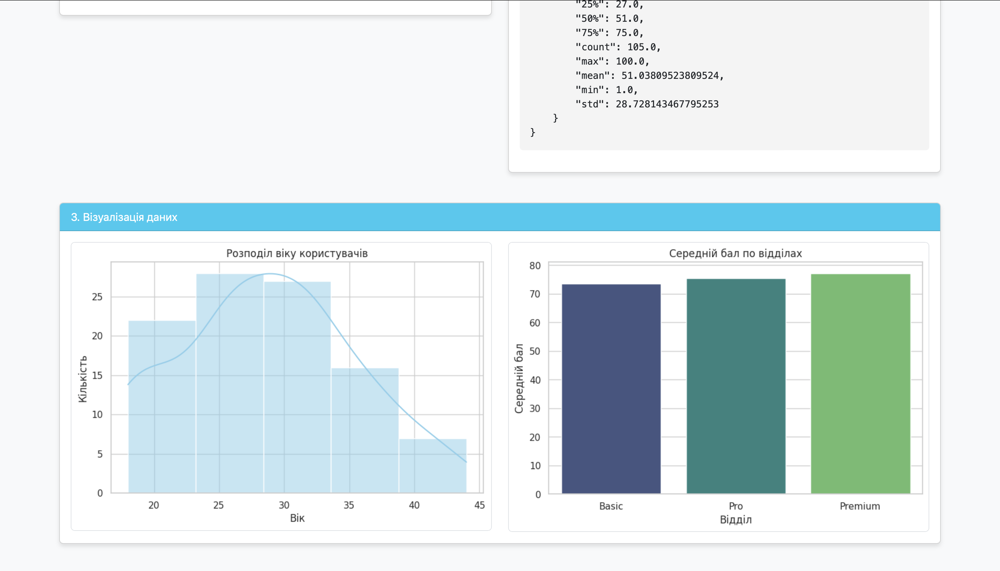

# Контейнеризація модулів проєкту за допомогою Docker
Посилання на GitHub https://github.com/MaksymZolotarchuk/docker-data-pipeline/blob/main/

## 1. Короткий звіт: Які сервіси створені
У рамках проєкту було спроєктовано та контейнеризовано 6 мікросервісів:
1. **db (PostgreSQL):** База даних для зберігання сирих даних. Налаштовано healthcheck для перевірки готовності.
2. **data_load:** Модуль завантаження. Зчитує `dataset.csv`, очікує готовності БД та імпортує дані у таблицю `raw_data`.
3. **data_quality_analysis:** Аналізатор. Перевіряє дані з БД на наявність пропусків, дублікатів та зберігає JSON-звіт.
4. **data_research:** Модуль статистики. Обчислює базові статистичні показники набору даних (JSON-звіт).
5. **visualization:** Модуль візуалізації. Будує графіки (Matplotlib/Seaborn) та зберігає їх у форматі `.png`.
6. **web:** Flask веб-сервер, який надає інтерфейс для перегляду згенерованих звітів та графіків у браузері.

---

## 2. Організація взаємодії сервісів
* **Мережа:** Усі контейнери знаходяться у спільній віртуальній мережі `lab_network` (bridge), що дозволяє сервісам підключатися до БД за внутрішнім ім'ям хоста `db`.
* **Порядок запуску (Синхронізація):** За допомогою `depends_on` налаштовано сувору чергу. `data_load` чекає на `service_healthy` від БД. Аналітичні модулі (`quality`, `research`, `visualization`) стартують лише після повної відпрацьовки завантажувача (`condition: service_completed_successfully`), що гарантує наявність таблиці.
* **Обмін даними (Volumes):** Для передачі звітів та картинок між контейнерами налаштовано спільні томи `shared_reports` та `shared_plots`. Модулі аналізу записують туди дані, а модуль `web` їх зчитує.

---

## 3. Труднощі, що виникли, та їх вирішення
* **Конфлікт портів на хост-машині (macOS):** Стандартний порт 5000 був зайнятий системною службою AirPlay Receiver (`bind: address already in use`). Вирішено прокиданням зовнішнього порту 5001 на внутрішній 5000 у `compose.yaml`.
* **Несумісність версій бібліотек:** Під час збирання виникла помилка `ValueError: numpy.dtype size changed` через конфлікт `pandas==2.1.0` із найновішим `numpy 2.0+`. Проблему вирішено фіксацією версії `numpy<2.0.0` у файлах `requirements.txt`.
* **Таймаути під час збирання (`TimeoutError`):** Через великий об'єм бібліотек при паралельному завантаженні процес переривався. Вирішено оптимізацією `Dockerfile` (додано `--no-cache-dir`) та збільшенням тайм-ауту/послідовним збиранням.

---

## 4. Структура проєкту

```text
docker_lab/
├── data/
│   └── dataset.csv              
├── data_load/
│   ├── app.py
│   ├── Dockerfile
│   └── requirements.txt
├── data_quality_analysis/
│   ├── app.py
│   ├── Dockerfile
│   └── requirements.txt
├── data_research/
│   ├── app.py
│   ├── Dockerfile
│   └── requirements.txt
├── visualization/
│   ├── app.py
│   ├── Dockerfile
│   └── requirements.txt
├── web/
│   ├── app.py
│   ├── Dockerfile
│   ├── requirements.txt
│   └── templates/
│       └── index.html           
├── screen/                      # Папка зі скріншотами результатів
├── .env                         # Змінні середовища (паролі БД)
├── compose.yaml                 # Оркестрація мікросервісів
└── README.md
```

## 5. Команди запуску
Для збирання образів та запуску всього пайплайну локально:
docker compose up --build

## 6. Перелік портів
* **5001** — порт веб-інтерфейсу (доступ з хост-машини через `http://localhost:5001`).
* **5432** — внутрішній порт PostgreSQL (доступний лише всередині Docker-мережі).

## 7. Скріншоти результатів роботи

### Запуск docker compose up у терміналі (Успішне відпрацювання сервісів)



### Список працюючих контейнерів (Docker Desktop)


### Веб-інтерфейс у браузері (Дашборд)


